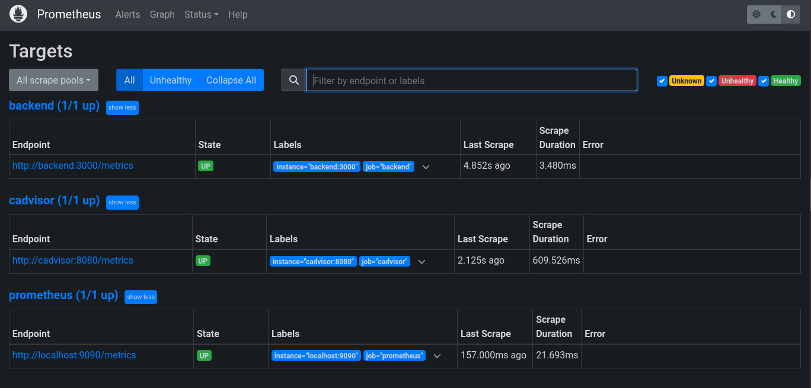

# Desafio técnico - Cubos DevOps

Este é um documento com os materiais que serão disponibilizado para o desafio técnico.

## Requisitos para executar o projeto
 - Docker
 - Terraform
 - Docker compose

 
### Setup
```bash
    git clone git@github.com:MatThHeuss/devops-test.git
    cd devops-test
```

### Executar Terraform
```bash
    terraform init
    terraform plan
    terraform apply -var-file="dev.tfvars"
```

### Executar docker compose para subir containers do grafana e prometheus
```bash
    docker compose up -d
```

### Visualizando o projeto
Após a execução do comando, o projeto deve estar disponivel no `localhost`


Para visualizar o dashboard do grafana basta acessar o `http://localhost:4000`


* Para acessar o grafana basta inserir as credenciais `admin` para user e `admin` para senha
* É possível importar os dashboards criados através do arquivos na pasta `grafana_dashboards`
* É necessário configurar o datasource do `prometheus` no grafana

Para visualizar o prometheus basta acessar o `http://localhost:9090`


* É possível visualizar as métricas coletadas através do endpoint `http://localhost:3000/metrics`